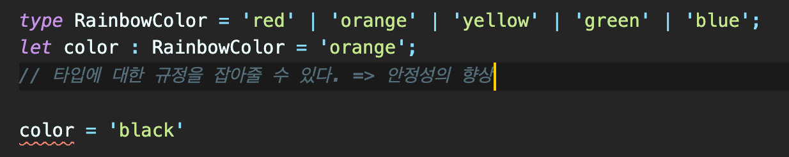

# 타입스크립트의 필요한 이유?

Javascript 웹의 변화에 맞춰서 살아남은 언어 ES2015 이후부터는 쓸만한 언어이다 웹, 앱 다양한 분야에서 사용된다.

자바스크립트는 향상되는데 왜 타입스크립트가 필요할까?

→ Javascript는 TypeScript의 Superset이다.

타입스크립트는 자바스크립트의 모든 기능을 제공 + 타입스크립트 만의 기능을 추가적으로 사용가능

타입스크립트는 공생의 역할... 

Type + Script ⇒ 자바스크립트가 제공하지 못하는 것 = 데이터에 대한 설명 (명시적 설명)

타입스크립트가 데이터에 대한 설명을 제공함으로써 자바스크립트와 공생한다.

즉 자바스크립트의 기본적인 것을 할 줄 알고 타입스크립트로 넘어가야된다. 

```jsx
let age = 10; // 10을 나이로 유추..
let x = 10; // 10의 데이터가 불분명
```

age라는 변수에 10이 들어가있다. 

x = 10 , age = 10 데이터가 불분명

## 타입스크립트의 경우

```jsx
let age = 10;
let weight:number = 80;
```

유형에 대한 것을 조정해 줄 수 있다.

```tsx
type Centimeter = number;
let height: Centimeter = 176;
// 코드상에서 유형으로 표현 가능
```

단순히 변수에 대한 타입을 정해준것 뿐만 아니라 유형까지도 정해줄 수 있다. ⇒ 표현력이 강화된다.

타입에 들어올수 있는것을 명시도 가능하다.

```tsx
type RainbowColor = 'red' | 'orange' | 'yellow' | 'green' | 'blue';
let color : RainbowColor = 'orange';
// 타입에 대한 규정을 잡아줄 수 있다. => 안정성의 향상
```

RainbowColor에 대한 명시가 가능해지기 때문이다.



color를 black으로 못 바꿈 , RainbowColor 에서 black에 대한 정의 가 없기 때문에 바꿀 수 없다.

타입스크립트의 타입정의, 타입제공은 트랜스 파일러 이기 때문에 가능하다.

기존에도 babel을 통해 상위 버젼을 하위 버젼으로 지원해주기 때문에 이질감이 떨어지고, 자바스크립트를 전부지원하고 추가로 타입 유형을 제공하기에 타입스크립트의 확장성이 넓어진다.

데이터 유형의 표현이 명확하지 않으면 문서나, 다른것을 찾아봐야될때가 많아진다.

코드자체가 데이터 유형을 설명하는게 중요하다.

타입유형 설명은 타입스크립트의 꽃이다.
